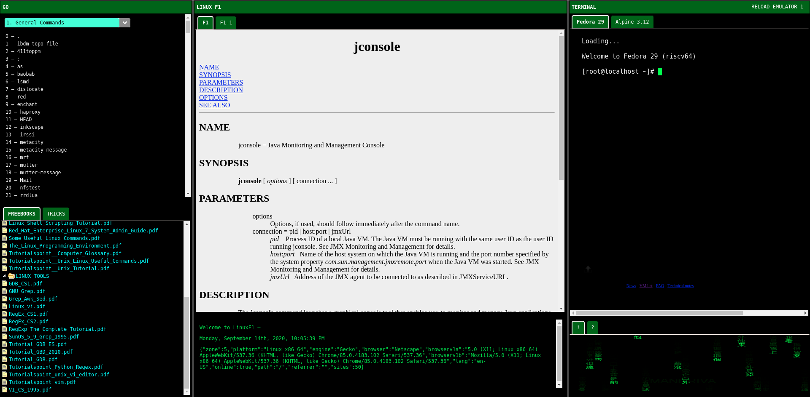

# **422 Linux Commands**
``` bash
 ^ ^              
(O,O)             
(   ) LINUX F1    
-"-"--------------
     ClusterBR

Document version v1.0.2
```

**Manual pages**, are an essential feature of **Unix-like operating systems**, including **Linux**. Manual pages are pre-installed and contains the official documentation and detailed descriptions of the system commands, utilities, and programming functions.

**Sections**: Manual pages are organized into different sections, each covering specific areas:

1. **Section 1: User Commands** – Commands for regular users (`ls`, `cd`, `cp`, `mv`, `rm`, `pwd`, ...).
2. **Section 2: System Calls** – Functions that provide services to programs by the kernel (`open`, `read`, `write`, `close`, `fork`, `exec`, ...).
3. **Section 3: Library Functions** – Functions provided by system libraries for use by programs (`printf`, `malloc`, `free`, `strcpy`, `strlen`, `fopen`, ...).
4. **Section 4: Devices and Drivers** – Commands related to devices and hardware management (`tty`, `shm`, `dmesg`, `lsblk`, `mount`, `lspci`, ...).
5. **Section 5: File Formats and Conventions** – Configuration files and file formats used by the system (`passwd`, `crontab`, `fstab`, `groupadd`, `ld.so.conf`, `hosts`, ...).
6. **Section 6: Games and Screens** – Fun or interactive programs (`nethack`, `fortune`, `cowsay`, `tetris`, `pacman`, `zombie`, ...).
7. **Section 7: Miscellaneous** – Commands that don't fit into other categories but are commonly used (`git`, `bash`, `grep`, `awk`, `sed`, `curl`, ...).
8. **Section 8: System Administration Commands** – Commands for system management and configuration (`systemctl`, `useradd`, `usermod`, `chmod`, `chown`, `service`, ...).

**Structure of Manual Pages** ─ Each manual-page is divided into several parts:

- **NAME**: Briefly describes the command or function.
- **SYNOPSIS**: Shows how to use the command, including syntax and options.
- **DESCRIPTION**: Provides more detailed information about the command or function.
- **OPTIONS**: Lists and explains the options/flags that can be used with the command.
- **EXAMPLES**: Gives practical examples of using the command.
- **SEE ALSO**: Provides references to related commands or topics.

**Bash scripting** is a powerful Linux shell feature that not only extends system management but also is widely used in areas such as **virtualization**, **containerization**, **DevOps**, **infrastructure as code (IaC)**, and more. Bash scripting is used to execute, simplify or automate: complex or time-demanding tasks, integration with cloud services, manage virtualized environments, deploy and orchestrate containers, and even create CI/CD pipelines. 

**Linux distributions** (CentOS, Debian, Fedora, Red Hat, Ubuntu, Arch Linux, ...) are released with between 1,000 and 2,000 commands. This document compiles 422 Linux commands, each with a one-line description.


## **List of 422 Linux commands**

1. **`a2disconf`** – Disable an Apache configuration file.    `$ ` `sudo a2disconf example.conf`
2. **`a2dismod`** – Disable an Apache module.    `$ ` `sudo a2dismod rewrite`
3. **`a2dissite`** – Disable an Apache site.    `$ ` `sudo a2dissite example.com`
4. **`a2enconf`** – Enable an Apache configuration file.    `$ ` `sudo a2enconf example.conf`
5. **`a2enmod`** – Enable an Apache module.    `$ ` `sudo a2enmod rewrite`
6. **`a2ensite`** – Enable an Apache site.    `$ ` `sudo a2ensite example.com`
7. **`a2query`** – Query Apache configuration.    `$ ` `a2query -m rewrite`
8. **`aa-enabled`** – Check if AppArmor is enabled.    `$ ` `aa-enabled`
9. **`aa-exec`** – Execute a command under an AppArmor profile.    `$ ` `aa-exec -p profile_name command`
10. **`aa-status`** – Display AppArmor status.    `$ ` `aa-status`
11. **`aa-teardown`** – Unload all AppArmor profiles.    `$ ` `sudo aa-teardown`
12. **`ab`** – Apache HTTP server benchmarking tool.  `$ ` `ab -n 100 -c 10 http://localhost/`
13. **`ac`** – Print the total connect time for users.  `$ ` `ac -p`
14. **`accton`** – Turn on process accounting.    `$ ` `sudo accton /var/log/account/pacct`
15. **`add-apt-repository`** – Add a repository to APT sources.    `$ ` `sudo add-apt-repository ppa:example/ppa`
16. **`addpart`** – Add a partition to a device.    `$ ` `sudo addpart /dev/sda 3 1024 2048`
17. **`agetty`** – Alternative Linux getty.    `$ ` `agetty tty1 9600`
18. **`alias`** – Create shortcuts for longer commands.  `$ ` `alias ll='ls -l'`
19. **`alsamixer`** – ALSA soundcard mixer.    `$ ` `alsamixer`
20. **`amidi`** – ALSA MIDI utility.    `$ ` `amidi -l`
21. **`amixer`** – ALSA soundcard mixer (command-line).    `$ ` `amixer sset Master 50%`
22. **`anacron`** – Run periodic jobs.    `$ ` `sudo anacron`
23. **`apache2ctl`** – Apache HTTP server control interface.    `$ ` `sudo apache2ctl restart`
24. **`apg`** – Generate random passwords.    `$ ` `apg -m 12`
25. **`apm`** – Advanced Power Management utility.    `$ ` `apm`
26. **`apmsleep`** – Suspend or hibernate using APM.    `$ ` `sudo apmsleep suspend`
27. **`apparmor_parser`** – Load AppArmor profiles.    `$ ` `sudo apparmor_parser -r /etc/apparmor.d/profile`
28. **`apply`** – Apply a command to a set of arguments.    `$ ` `apply "echo" file1 file2`
29. **`apropos`** – Search the man pages for a keyword.  `$ ` `apropos copy`
30. **`apt-cache`** – Query the APT cache (Debian/Ubuntu).  `$ ` `apt-cache search vim`
31. **`apt-get`** – APT package handling utility (Debian/Ubuntu).  `$ ` `sudo apt-get install vim`
32. **`apt-key`** – Manage keys for APT repositories.  `$ ` `sudo apt-key adv --keyserver keyserver.ubuntu.com --recv-keys <key>`
33. **`apt-mark`** – Mark or unmark packages as automatically installed.    `$ ` `sudo apt-mark auto package_name`
34. **`apt-sortpkgs`** – Sort APT package lists.    `$ ` `apt-sortpkgs file.list`
35. **`apt`** – Package management system for Debian-based distributions.  `$ ` `sudo apt update`
36. **`ar`** – Create, modify, and extract from archives.  `$ ` `ar x archive.a`
37. **`arch`** – Display machine architecture.  `$ ` `arch`
38. **`arj`** – Compress or extract .arj archives.    `$ ` `arj x archive.arj`
39. **`arping`** – Send ARP requests to a neighbor.    `$ ` `arping -I eth0 192.168.1.1`
40. **`as`** – The GNU assembler.  `$ ` `as -o file.o file.s`
41. **`at`** – Schedule a one-time task to be executed later.  `$ ` `at 09:00 < command`
42. **`atq`** – Display the at job queue.    `$ ` `atq`
43. **`atrm`** – Remove a job from the at queue.  `$ ` `atrm 1`
44. **`atrun`** – Run at jobs.    `$ ` `sudo atrun`
45. **`authconfig`** – Configure system authentication.    `$ ` `sudo authconfig --update`
46. **`authselect`** – Configure system authentication (modern replacement for authconfig).    `$ ` `sudo authselect select sssd`
47. **`autoconf`** – Generate configuration scripts.    `$ ` `autoconf`
48. **`automake`** – Generate Makefile.in files.    `$ ` `automake`
49. **`autoreconf`** – Rebuild configure scripts.    `$ ` `autoreconf`
50. **`autoscan`** – Generate a preliminary configure.ac.    `$ ` `autoscan`
51. **`autoupdate`** – Update configure.ac to newer standards.    `$ ` `autoupdate`
52. **`awk`** – Pattern scanning and processing language.  `$ ` `awk '{print $1}' file.txt`
53. **`axel`** – Lightweight command-line download accelerator.    `$ ` `axel http://example.com/file.txt`
54. **`badblocks`** – Search for bad blocks on a device.    `$ ` `sudo badblocks /dev/sda`
55. **`base32`** – Encode or decode data in base32.    `$ ` `echo "hello" | base32`
56. **`base64`** – Encode or decode data in base64.    `$ ` `echo "hello" | base64`
57. **`basename`** – Strip directory and suffix from filenames.  `$ ` `basename /path/to/file.txt`
58. **`basenc`** – Encode or decode data in various formats.    `$ ` `basenc --base64 file.txt`
59. **`bashbug`** – Report a bug in Bash.    `$ ` `bashbug`
60. **`batch`** – Execute commands when system load levels permit.  `$ ` `batch`
61. **`bc`** – Command-line calculator.  `$ ` `echo "5+2" | bc`
62. **`bccmd`** – Send BlueCore commands.    `$ ` `bccmd -t bcsp /dev/ttyS0`
63. **`bchunk`** – Convert a CD image to an ISO file.    `$ ` `bchunk file.bin file.cue file.iso`
64. **`bdftopcf`** – Convert BDF fonts to PCF format.    `$ ` `bdftopcf font.bdf`
65. **`beep`** – Produce a beep sound.    `$ ` `beep`
66. **`bg`** – Resume a suspended job in the background.  `$ ` `bg %1`
67. **`bind`** – Show or set key bindings for the shell.  `$ ` `bind -P`
68. **`bison`** – GNU parser generator.    `$ ` `bison file.y`
69. **`blkdiscard`** – Discard sectors on a device.    `$ ` `sudo blkdiscard /dev/sda`
70. **`blkid`** – Locate/print block device attributes.    `$ ` `blkid /dev/sda1`
71. **`blockdev`** – Call block device ioctls.    `$ ` `sudo blockdev --report /dev/sda`
72. **`bootctl`** – Manage systemd-boot.    `$ ` `sudo bootctl status`
73. **`brctl`** – Manage Ethernet bridges.    `$ ` `sudo brctl addbr br0`
74. **`break`** – Exit from a loop.  `$ ` `for i in 1 2 3; do break; done`
75. **`bsdtar`** – Manipulate tar archives.    `$ ` `bsdtar -xvf archive.tar`
76. **`btrfs`** – Manage Btrfs filesystems.    `$ ` `sudo btrfs subvolume create /mnt/subvol`
77. **`bunzip2`** – Decompress .bz2 files.    `$ ` `bunzip2 file.bz2`
78. **`busctl`** – Introspect the D-Bus.    `$ ` `busctl list`
79. **`byobu`** – Text-based window manager and terminal multiplexer.    `$ ` `byobu`
80. **`bzcat`** – Decompress `.bz2` files.  `$ ` `bzcat file.bz2`
81. **`bzcmp`** – Compare bzip2 compressed files.  `$ ` `bzcmp file1.bz2 file2.bz2`
82. **`bzdiff`** – Compare `.bz2` files.  `$ ` `bzdiff file1.bz2 file2.bz2`
83. **`bzexe`** – Compress executable files.    `$ ` `bzexe file`
84. **`bzgrep`** – Search `.bz2` files with `grep`.  `$ ` `bzgrep "pattern" file.bz2`
85. **`bzip2`** – Compress files using Burrows-Wheeler block sorting.  `$ ` `bzip2 file.txt`
86. **`bzip2recover`** – Recover data from a corrupted `.bz2` file.  `$ ` `bzip2recover file.bz2`
87. **`bzless`** – View .bz2 files with less.    `$ ` `bzless file.bz2`
88. **`bzmore`** – View .bz2 files page by page.    `$ ` `bzmore file.bz2`
89. **`c99`** – Compile C programs.    `$ ` `c99 -o program program.c`
90. **`cal`** – Display a calendar.  `$ ` `cal 2025`
91. **`calibrate_ppa`** – Calibrate a PPA (Pulse Per Second) device.    `$ ` `sudo calibrate_ppa`
92. **`cancel`** – Cancel a print job.  `$ ` `cancel 123`
93. **`capinfo`** – Display capabilities of a file.    `$ ` `capinfo file`
94. **`capsh`** – Set or get capabilities for a process.  `$ ` `capsh --print`
95. **`captoinfo`** – Convert termcap to terminfo.    `$ ` `captoinfo file.termcap`
96. **`case`** – Conditional statement in shell scripts.    `$ ` `case $var in pattern) command;; esac`
97. **`cat`** – Concatenate and display file contents.  `$ ` `cat file.txt`
98. **`catman`** – Create or update the manual page cache.    `$ ` `sudo catman`
99. **`cd`** – Change the current directory.  `$ ` `cd /home/user`
100. **`cdrecord`** – Record CDs or DVDs.    `$ ` `cdrecord dev=/dev/cdrom file.iso`
101. **`cfdisk`** – Partition table manipulator.    `$ ` `sudo cfdisk /dev/sda`
102. **`chattr`** – Change file attributes on a Linux file system.  `$ ` `chattr +i file.txt`
103. **`chcon`** – Change the SELinux security context of a file.  `$ ` `chcon -t httpd_sys_content_t file.txt`
104. **`chgrp`** – Change the group ownership of a file.  `$ ` `chgrp group file.txt`
105. **`chkconfig`** – Manage system services.  `$ ` `sudo chkconfig --list`
106. **`chmod`** – Change file permissions.  `$ ` `chmod 755 file.sh`
107. **`chown`** – Change file owner and group.  `$ ` `chown user:group file.txt`
108. **`chroot`** – Change root directory for a command.  `$ ` `chroot /newroot /bin/bash`
109. **`cksum`** – Calculate a CRC checksum of a file.  `$ ` `cksum file.txt`
110. **`clear`** – Clear the terminal screen.  `$ ` `clear`
111. **`cmp`** – Compare two files byte by byte.  `$ ` `cmp file1.txt file2.txt`
112. **`comm`** – Compare two sorted files line by line.  `$ ` `comm file1.txt file2.txt`
113. **`consoletype`** – Display the type of terminal in use.  `$ ` `consoletype`
114. **`continue`** – Resume the next iteration of a loop.  `$ ` `continue`
115. **`cp`** – Copy files or directories.  `$ ` `cp file1.txt file2.txt`
116. **`cpio`** – Copy files to and from archives.  `$ ` `cpio -o < files.txt`
117. **`cron`** – Daemon to execute scheduled commands.  `$ ` `cron`
118. **`crontab`** – Edit the cron jobs for the current user.  `$ ` `crontab -e`
119. **`csplit`** – Split a file into sections based on context.  `$ ` `csplit file.txt /pattern/ {2}`
120. **`ctrlaltdel`** – Reboot the system using a keyboard shortcut.  `$ ` `ctrlaltdel`
121. **`curl`** – Transfer data with URLs.  `$ ` `curl -O http://example.com/file.txt`
122. **`cut`** – Remove sections from each line of files.  `$ ` `cut -d, -f1 file.csv`
123. **`date`** – Display or set the system date and time.  `$ ` `date "+%Y-%m-%d"`
124. **`dc`** – Desk calculator for arbitrary precision arithmetic.  `$ ` `echo "2 3 + p" | dc`
125. **`dd`** – Copy and convert files.  `$ ` `dd if=/dev/sda of=/dev/sdb`
126. **`declare`** – Declare variables and their attributes.  `$ ` `declare -i num=10`
127. **`df`** – Report disk space usage.  `$ ` `df -h`
128. **`diff3`** – Compare three files line by line.  `$ ` `diff3 file1.txt file2.txt file3.txt`
129. **`diff`** – Compare files line by line.  `$ ` `diff file1.txt file2.txt`
130. **`dig`** – DNS lookup utility.  `$ ` `dig google.com`
131. **`dir`** – List directory contents.  `$ ` `dir /home/user`
132. **`dircolors`** – Set terminal color schemes for `ls`.  `$ ` `dircolors`
133. **`dirname`** – Strip the last component from the file name.  `$ ` `dirname /path/to/file.txt`
134. **`dirs`** – Display the directory stack.  `$ ` `dirs`
135. **`dmesg`** – Print or control the kernel ring buffer.  `$ ` `dmesg | grep error`
136. **`dnf`** – Package manager for Fedora and Red Hat.  `$ ` `sudo dnf install vim`
137. **`docker`** – Manage Docker containers and images.  `$ ` `docker run hello-world`
138. **`dpkg`** – Debian package manager for installing, removing, and querying packages.  `$ ` `dpkg -i package.deb`
139. **`dstat`** – Versatile resource statistics tool.  `$ ` `dstat`
140. **`du`** – Estimate file space usage.  `$ ` `du -sh /home/user`
141. **`echo`** – Display a line of text.  `$ ` `echo "Hello, world!"`
142. **`egrep`** – Extended regular expressions for `grep`.  `$ ` `egrep '^test' file.txt`
143. **`eject`** – Eject removable media like CD/DVD.  `$ ` `eject`
144. **`enable`** – Enable a shell built-in command.  `$ ` `enable -n echo`
145. **`env`** – Display environment variables.  `$ ` `env`
146. **`ethtool`** – Display or change network interface settings.  `$ ` `ethtool eth0`
147. **`eval`** – Evaluate and execute arguments as a command.  `$ ` `eval echo hello`
148. **`ex`** – Ex editor, part of the vi editor.  `$ ` `ex file.txt`
149. **`exec`** – Execute a command in the current shell.  `$ ` `exec ls -l`
150. **`exit`** – Exit the shell.  `$ ` `exit`
151. **`expand`** – Convert tabs to spaces.  `$ ` `expand file.txt`
152. **`expect`** – Automate interactive applications.  `$ ` `expect script.exp`
153. **`export`** – Set environment variables.  `$ ` `export PATH=$PATH:/new/path`
154. **`expr`** – Evaluate expressions.  `$ ` `expr 3 + 2`
155. **`factor`** – Factorize a number.  `$ ` `factor 28`
156. **`fakechroot`** – Run a command with fake root privileges.  `$ ` `fakechroot ls`
157. **`false`** – Do nothing, return failure status.  `$ ` `false`
158. **`fc`** – Fix or re-edit commands from the history.  `$ ` `fc`
159. **`fdisk`** – Partition table manipulator for Linux.  `$ ` `fdisk /dev/sda`
160. **`fg`** – Bring a background job to the foreground.  `$ ` `fg %1`
161. **`fgrep`** – Fixed-string search for `grep`.  `$ ` `fgrep "pattern" file.txt`
162. **`file`** – Determine file type.  `$ ` `file file.txt`
163. **`find`** – Search for files in a directory hierarchy.  `$ ` `find /home -name '*.txt'`
164. **`finger`** – User information lookup program.  `$ ` `finger user`
165. **`fmt`** – Simple text formatter.  `$ ` `fmt file.txt`
166. **`fold`** – Wrap text to a specified width.  `$ ` `fold -w 80 file.txt`
167. **`for`** – Loop through a list of values.  `$ ` `for i in {1..5}; do echo $i; done`
168. **`free`** – Display memory usage.  `$ ` `free -h`
169. **`fsck`** – File system consistency check.  `$ ` `fsck /dev/sda1`
170. **`ftp`** – File Transfer Protocol client.  `$ ` `ftp ftp.example.com`
171. **`function`** – Define a function in the shell.  `$ ` `function myfunc { echo "Hello"; }`
172. **`fuser`** – Identify processes using a file.  `$ ` `fuser file.txt`
173. **`g++`** – GNU C++ compiler.  `$ ` `g++ file.cpp -o file`
174. **`gawk`** – Pattern scanning and processing language.  `$ ` `gawk '{print $1}' file.txt`
175. **`gcc`** – GNU C compiler.  `$ ` `gcc -o program program.c`
176. **`gdb`** – GNU debugger.  `$ ` `gdb ./program`
177. **`gedit`** – GUI text editor for GNOME.  `$ ` `gedit file.txt`
178. **`getent`** – Get entries from databases.  `$ ` `getent passwd user`
179. **`getfacl`** – Get file access control lists.  `$ ` `getfacl file.txt`
180. **`getopt`** – Parse command-line options.  `$ ` `getopt -o ab: file.txt`
181. **`getopts`** – Parse positional parameters in a shell script.  `$ ` `getopts "a:b:" opt`
182. **`git`** – Version control system for tracking changes in files.  `$ ` `git status`
183. **`grep`** – Search for patterns in files.  `$ ` `grep 'pattern' file.txt`
184. **`groupadd`** – Add a new group.  `$ ` `sudo groupadd mygroup`
185. **`groupdel`** – Delete a group.  `$ ` `sudo groupdel mygroup`
186. **`groupmod`** – Modify a group.  `$ ` `sudo groupmod -n newgroup oldgroup`
187. **`groups`** – Show user groups.  `$ ` `groups username`
188. **`gunzip`** – Decompress `.gz` files.  `$ ` `gunzip file.gz`
189. **`gzip`** – Compress files using the gzip algorithm.  `$ ` `gzip file.txt`
190. **`halt`** – Halt the system immediately.  `$ ` `halt`
191. **`hash`** – Remember the full path of a command.  `$ ` `hash`
192. **`hd`** – Display files in hexadecimal format.  `$ ` `hd file.txt`
193. **`head`** – Output the first part of files.  `$ ` `head -n 10 file.txt`
194. **`history`** – Show the history of commands used in the shell.  `$ ` `history`
195. **`host`** – DNS lookup utility.  `$ ` `host google.com`
196. **`hostname`** – Show or set the system’s hostname.  `$ ` `hostname`
197. **`hostnamectl`** – Control the system hostname.  `$ ` `hostnamectl set-hostname newhostname`
198. **`htop`** – Interactive process viewer.  `$ ` `htop`
199. **`iconv`** – Convert between different character encodings.  `$ ` `iconv -f utf-8 -t iso-8859-1 file.txt`
200. **`id`** – Print user and group information.  `$ ` `id`
201. **`ifconfig`** – Configure network interfaces.  `$ ` `ifconfig eth0`
202. **`ifdown`** – Shut down a network interface.  `$ ` `sudo ifdown eth0`
203. **`ifup`** – Bring a network interface up.  `$ ` `sudo ifup eth0`
204. **`inotifywait`** – Wait for changes to files using inotify.  `$ ` `inotifywait /path/to/file`
205. **`install`** – Copy files and set attributes.  `$ ` `install -m 755 file /path/to/destination`
206. **`inxi`** – Display system information.  `$ ` `inxi -Fxz`
207. **`iostat`** – CPU and I/O statistics.  `$ ` `iostat`
208. **`iotop`** – Display real-time I/O usage by processes.  `$ ` `iotop`
209. **`ip addr`** – Show or manipulate IP addresses.  `$ ` `ip addr show`
210. **`ip link`** – Show or manipulate network interfaces.  `$ ` `ip link show`
211. **`ip route`** – Show or manipulate IP routing.  `$ ` `ip route show`
212. **`ip rule`** – Show or manipulate routing policy database.  `$ ` `ip rule show`
213. **`ip tunnel`** – Show or configure tunnels.  `$ ` `ip tunnel add tun0 mode gre remote 192.168.1.1 local 192.168.1.2`
214. **`ip`** – Show/manipulate network interfaces, routing, etc.  `$ ` `ip addr show`
215. **`ipcalc`** – Perform IP calculations.  `$ ` `ipcalc 192.168.0.0/24`
216. **`iptables`** – User-space utility for configuring Linux kernel firewall.  `$ ` `sudo iptables -L`
217. **`is`** – List information about a file or directory.  `$ ` `is file.txt`
218. **`isoinfo`** – Display information about ISO-9660 filesystems.  `$ ` `isoinfo -i file.iso -d`
219. **`iw`** – Show or manipulate wireless devices and settings.  `$ ` `iw dev wlan0 link`
220. **`iwconfig`** – Configure wireless network interfaces.  `$ ` `iwconfig wlan0 essid "Network"`
221. **`iwlist`** – Get more detailed wireless network information.  `$ ` `iwlist wlan0 scan`
222. **`jobs`** – Display active jobs in the current shell.  `$ ` `jobs`
223. **`join`** – Join lines of two files on a common field.  `$ ` `join file1.txt file2.txt`
224. **`journalctl`** – Query systemd journal logs.  `$ ` `journalctl -u apache2`
225. **`jq`** – Command-line JSON processor.  `$ ` `jq '.name' file.json`
226. **`kill`** – Terminate a process.  `$ ` `kill 1234`
227. **`killall`** – Kill processes by name.  `$ ` `killall firefox`
228. **`kmod`** – Manage kernel modules.  `$ ` `kmod list`
229. **`last`** – Show the last logins of users.  `$ ` `last`
230. **`less`** – View file contents interactively.  `$ ` `less file.txt`
231. **`let`** – Perform arithmetic operations in the shell.  `$ ` `let x=5+3`
232. **`ln`** – Create hard or symbolic links.  `$ ` `ln -s /path/to/file symlink`
233. **`loadkeys`** – Change the keyboard layout.  `$ ` `loadkeys us`
234. **`local`** – Declare local variables in shell functions.  `$ ` `local var=10`
235. **`locate`** – Find files by name using a database.  `$ ` `locate file.txt`
236. **`login`** – Begin a session on the system.  `$ ` `login`
237. **`logname`** – Print the name of the current user.  `$ ` `logname`
238. **`ls`** – List directory contents.  `$ ` `ls -l`
239. **`lsattr`** – List file attributes on a Linux second extended file system.  `$ ` `lsattr file.txt`
240. **`lsblk`** – List information about block devices.  `$ ` `lsblk`
241. **`lscpu`** – Display information about the CPU architecture.  `$ ` `lscpu`
242. **`lshw`** – Display detailed hardware information.  `$ ` `lshw -short`
243. **`lsmod`** – Show the status of modules in the Linux kernel.  `$ ` `lsmod`
244. **`lsof`** – List open files.  `$ ` `lsof -i`
245. **`lspci`** – List all PCI devices.  `$ ` `lspci`
246. **`lsscsi`** – List SCSI devices.  `$ ` `lsscsi`
247. **`lssubsys`** – Show system device hierarchies.  `$ ` `lssubsys`
248. **`lsusb`** – List all USB devices.  `$ ` `lsusb`
249. **`machinectl`** – Control local and remote containers.  `$ ` `machinectl list`
250. **`man`** – Display the manual pages for a command.  `$ ` `man ls`
251. **`md5sum`** – Calculate and check MD5 checksums.  `$ ` `md5sum file.txt`
252. **`mii-tool`** – Query or control the MII status of network interfaces.  `$ ` `mii-tool eth0`
253. **`mkdir`** – Create directories.  `$ ` `mkdir mydir`
254. **`mkfifo`** – Create a named pipe (FIFO).  `$ ` `mkfifo mypipe`
255. **`mkfs`** – Create a file system.  `$ ` `sudo mkfs.ext4 /dev/sda1`
256. **`mkisofs`** – Create an ISO 9660 filesystem image.  `$ ` `mkisofs -o image.iso /path/to/files`
257. **`mknod`** – Create a special file.  `$ ` `mknod mydevice c 89 1`
258. **`mktemp`** – Create a temporary file or directory.  `$ ` `mktemp`
259. **`more`** – View file contents page by page.  `$ ` `more file.txt`
260. **`mount -o loop`** – Mount an ISO image as a file system.  `$ ` `sudo mount -o loop file.iso /mnt`
261. **`mount`** – Mount a file system.  `$ ` `mount /dev/sda1 /mnt`
262. **`mpstat`** – Report CPU statistics.  `$ ` `mpstat -P ALL`
263. **`mtr`** – Network diagnostic tool combining `ping` and `traceroute`.  `$ ` `mtr google.com`
264. **`mv`** – Move or rename files or directories.  `$ ` `mv file.txt /path/to/destination/`
265. **`namei`** – Follow a path to its components.  `$ ` `namei -l /path/to/file`
266. **`nano`** – Command-line text editor.  `$ ` `nano file.txt`
267. **`nc`** – Netcat, a utility for reading from and writing to network connections.  `$ ` `nc -l 1234`
268. **`netcat`** – Another name for `nc`.  `$ ` `netcat -z -v 192.168.1.1 1-1000`
269. **`netstat`** – Display network connections, routing tables, and more.  `$ ` `netstat -tuln`
270. **`newgrp`** – Log in to a new group.  `$ ` `newgrp staff`
271. **`nice`** – Start a process with a modified scheduling priority.  `$ ` `nice -n 10 command`
272. **`nl`** – Number lines of a file.  `$ ` `nl file.txt`
273. **`nm`** – List symbols from object files.  `$ ` `nm /path/to/file.o`
274. **`nmcli`** – Command-line interface for NetworkManager.  `$ ` `nmcli device status`
275. **`nohup`** – Run a command immune to hangups.  `$ ` `nohup command &`
276. **`nproc`** – Show the number of processing units available.  `$ ` `nproc`
277. **`nslookup`** – Query Internet name servers interactively.  `$ ` `nslookup google.com`
278. **`ntpdate`** – Synchronize the system clock with a remote NTP server.  `$ ` `sudo ntpdate time.google.com`
279. **`numactrl`** – Control NUMA (Non-Uniform Memory Access) policy.  `$ ` `numactrl --interleave=all`
280. **`od`** – Dump files in octal, hexadecimal, or ASCII.  `$ ` `od -c file.txt`
281. **`parted`** – A command-line partition manipulation program.  `$ ` `parted /dev/sda`
282. **`passwd`** – Change user password.  `$ ` `passwd user`
283. **`paste`** – Merge lines of files.  `$ ` `paste file1.txt file2.txt`
284. **`patch`** – Apply a patch file to source code.  `$ ` `patch < patchfile.diff`
285. **`pathchk`** – Check the validity of a file name or path.  `$ ` `pathchk /path/to/file`
286. **`pg`** – View file contents with scrolling and searching.  `$ ` `pg file.txt`
287. **`pidof`** – Find the PID of a running program.  `$ ` `pidof firefox`
288. **`ping`** – Send ICMP echo requests to network hosts.  `$ ` `ping google.com`
289. **`pkill`** – Kill processes by name.  `$ ` `pkill firefox`
290. **`pl`** – Perl pager for reading output.  `$ ` `pl file.txt`
291. **`pluto`** – Network time protocol for synchronization.  `$ ` `pluto`
292. **`pmap`** – Display memory usage of processes.  `$ ` `pmap 1234`
293. **`pmount`** – Mount removable devices automatically.  `$ ` `pmount /dev/sdb1`
294. **`popd`** – Pop a directory from the directory stack.  `$ ` `popd`
295. **`poweroff`** – Shut down the system immediately.  `$ ` `poweroff`
296. **`pr`** – Format text files for printing.  `$ ` `pr file.txt`
297. **`printenv`** – Print all or specific environment variables.  `$ ` `printenv PATH`
298. **`printf`** – Format and print data.  `$ ` `printf "Hello, %s!\n" "world"`
299. **`ps`** – Report a snapshot of current processes.  `$ ` `ps aux`
300. **`pstree`** – Display processes in a tree format.  `$ ` `pstree`
301. **`ptables`** – Display current network port tables.  `$ ` `ptables`
302. **`pushd`** – Save the current directory and change to a new one.  `$ ` `pushd /home/user`
303. **`pwd`** – Print the current working directory.  `$ ` `pwd`
304. **`quota`** – Display disk usage and limits for users.  `$ ` `quota -u user`
305. **`quotacheck`** – Check file system disk quotas.  `$ ` `quotacheck -avug`
306. **`ram`** – Manage system memory (less common, might be specific to certain distributions).  `$ ` `ram status`
307. **`ramdisk`** – Create a RAM-based file system.  `$ ` `ramdisk /mnt/ramdisk`
308. **`read`** – Read a line of input from standard input.  `$ ` `read varname`
309. **`reboot`** – Reboot the system.  `$ ` `sudo reboot`
310. **`rename`** – Rename files according to regular expressions.  `$ ` `rename 's/.txt/.bak/' *.txt`
311. **`renice`** – Change the priority of running processes.  `$ ` `renice -n 10 -p 1234`
312. **`reorder`** – Reorder the lines in a file based on a key.  `$ ` `reorder file.txt`
313. **`reset`** – Reset the terminal.  `$ ` `reset`
314. **`resize`** – Set terminal window size.  `$ ` `resize`
315. **`rev`** – Reverse the lines of a file.  `$ ` `rev file.txt`
316. **`rm`** – Remove files or directories.  `$ ` `rm file.txt`
317. **`rmdir`** – Remove empty directories.  `$ ` `rmdir mydir`
318. **`route`** – Show or manipulate the IP routing table.  `$ ` `route -n`
319. **`rsync`** – Remote file and directory synchronization.  `$ ` `rsync -avz source/ destination/`
320. **`runlevel`** – Show the current runlevel.  `$ ` `runlevel`
321. **`scp`** – Securely copy files between hosts.  `$ ` `scp file.txt user@remotehost:/path/to/destination`
322. **`screen`** – Terminal multiplexer to manage multiple sessions.  `$ ` `screen`
323. **`sd`** – Stream editor (a more minimal version of `sed`).  `$ ` `sd 'old' 'new' file.txt`
324. **`sdparm`** – Set or get device parameters.  `$ ` `sdparm --all /dev/sda`
325. **`sed`** – Stream editor for filtering and transforming text.  `$ ` `sed 's/old/new/' file.txt`
326. **`select`** – Select from a list of options.  `$ ` `select var in option1 option2; do break; done`
327. **`service`** – Start, stop, or restart system services.  `$ ` `sudo service apache2 restart`
328. **`set`** – Set or display shell variables.  `$ ` `set var=value`
329. **`sftp`** – Secure File Transfer Protocol.  `$ ` `sftp user@remotehost`
330. **`sh`** – Command interpreter (shell).  `$ ` `sh script.sh`
331. **`sha256sum`** – Compute and check SHA-256 checksums.  `$ ` `sha256sum file.txt`
332. **`shutdown`** – Shutdown the system.  `$ ` `sudo shutdown -h now`
333. **`sl`** – Steam Locomotive (funny command).  `$ ` `sl`
334. **`sleep`** – Delay for a specified amount of time.  `$ ` `sleep 5`
335. **`sort`** – Sort lines in text files.  `$ ` `sort file.txt`
336. **`source`** – Read and execute commands from a file in the current shell.  `$ ` `source ~/.bashrc`
337. **`split`** – Split files into pieces.  `$ ` `split -l 100 file.txt`
338. **`ss`** – Utility to investigate sockets.  `$ ` `ss -tuln`
339. **`ssh`** – Secure Shell client to access remote machines.  `$ ` `ssh user@remotehost`
340. **`stat`** – Display file or file system status.  `$ ` `stat file.txt`
341. **`strace`** – Trace system calls and signals.  `$ ` `strace -p 1234`
342. **`stty`** – Change and print terminal line settings.  `$ ` `stty -a`
343. **`su`** – Switch user or execute a command as another user.  `$ ` `su - user`
344. **`sudo`** – Execute commands as another user (typically root).  `$ ` `sudo apt-get update`
345. **`sum`** – Calculate file checksum and block counts.  `$ ` `sum file.txt`
346. **`symlink`** – Create symbolic links.  `$ ` `ln -s /path/to/file symlink`
347. **`sync`** – Synchronize the file system.  `$ ` `sync`
348. **`sysctl`** – Configure kernel parameters at runtime.  `$ ` `sysctl net.ipv4.ip_forward=1`
349. **`systemctl`** – Control the systemd system and service manager.  `$ ` `sudo systemctl restart apache2`
350. **`tac`** – Concatenate and print files in reverse.  `$ ` `tac file.txt`
351. **`tail`** – Output the last part of files.  `$ ` `tail -n 10 file.txt`
352. **`tar`** – Archive files into a tarball.  `$ ` `tar -czvf archive.tar.gz /path/to/directory`
353. **`tee`** – Read from standard input and write to standard output and files.  `$ ` `echo "Hello" | tee file.txt`
354. **`telnet`** – User interface for the Telnet protocol.  `$ ` `telnet remotehost`
355. **`test`** – Check file types and compare values.  `$ ` `test -e file.txt`
356. **`time`** – Measure program execution time.  `$ ` `time ls`
357. **`timeout`** – Run a command with a time limit.  `$ ` `timeout 5s command`
358. **`times`** – Display user and system times for processes.  `$ ` `times`
359. **`top`** – Display tasks and resource usage in real-time.  `$ ` `top`
360. **`touch`** – Change file timestamps or create an empty file.  `$ ` `touch file.txt`
361. **`tput`** – Initialize terminal capabilities.  `$ ` `tput setaf 1` (sets text color to red)
362. **`tr`** – Translate or delete characters from input.  `$ ` `echo "abc" | tr 'a' 'x'`
363. **`tracepath`** – Traceroute with automatic MTU discovery.  `$ ` `tracepath google.com`
364. **`traceroute`** – Trace the route packets take to a network host.  `$ ` `traceroute google.com`
365. **`trap`** – Set up signal handling in scripts.  `$ ` `trap "echo Goodbye" EXIT`
366. **`tree`** – Display directory structure as a tree.  `$ ` `tree /path`
367. **`true`** – Do nothing, return success status.  `$ ` `true`
368. **`ts`** – Timestamp output (part of `moreutils`).  `$ ` `echo "hello" | ts`
369. **`tty`** – Print the terminal type.  `$ ` `tty`
370. **`type`** – Display information about a command type.  `$ ` `type ls`
371. **`ulimit`** – Get or set user resource limits.  `$ ` `ulimit -a`
372. **`umask`** – Set the file mode creation mask.  `$ ` `umask 022`
373. **`umount`** – Unmount file systems.  `$ ` `sudo umount /mnt`
374. **`unalias`** – Remove aliases.  `$ ` `unalias ll`
375. **`uname`** – Print system information.  `$ ` `uname -r`
376. **`unzip`** – Extract files from a ZIP archive.  `$ ` `unzip archive.zip`
377. **`uptime`** – Show how long the system has been running.  `$ ` `uptime`
378. **`useradd`** – Add a new user to the system.  `$ ` `sudo useradd user`
379. **`userdel`** – Delete a user account.  `$ ` `sudo userdel user`
380. **`usermod`** – Modify a user account.  `$ ` `sudo usermod -aG group user`
381. **`uuidgen`** – Generate a new universally unique identifier (UUID).  `$ ` `uuidgen`
382. **`vdir`** – List directories in a detailed format.  `$ ` `vdir`
383. **`vi`** – A text editor.  `$ ` `vi file.txt`
384. **`view`** – View a file with `vi` in read-only mode.  `$ ` `view file.txt`
385. **`w`** – Display who is logged in and what they are doing.  `$ ` `w`
386. **`wait`** – Wait for a process to complete.  `$ ` `wait $!`
387. **`wall`** – Send a message to all users.  `$ ` `wall "System will shut down in 10 minutes"`
388. **`watch`** – Execute a program periodically and show output.  `$ ` `watch df -h`
389. **`wc`** – Count words, lines, and characters in files.  `$ ` `wc file.txt`
390. **`wget`** – Download files from the web.  `$ ` `wget http://example.com/file.txt`
391. **`whatis`** – Display a one-line description of a command.  `$ ` `whatis ls`
392. **`whereis`** – Locate binary, source, and man pages for a command.  `$ ` `whereis ls`
393. **`which`** – Show the full path of a command.  `$ ` `which python`
394. **`who`** – Show who is logged in.  `$ ` `who`
395. **`whoami`** – Show the current logged-in user.  `$ ` `whoami`
396. **`wpa_cli`** – Control the wpa_supplicant (wireless network configuration).  `$ ` `wpa_cli status`
397. **`write`** – Send a message to another user.  `$ ` `write user`
398. **`xargs`** – Build and execute command lines from input.  `$ ` `echo "file1 file2" | xargs rm`
399. **`xdg-open`** – Open a file or URL in the user's preferred application.  `$ ` `xdg-open http://example.com`
400. **`yes`** – Output a string repeatedly.  `$ ` `yes "hello"`
401. **`zcat`** – Concatenate and display compressed files.  `$ ` `zcat file.gz`
402. **`zcmp`** – Compare compressed files.  `$ ` `zcmp file1.gz file2.gz`
403. **`zdiff`** – Compare compressed files line by line.  `$ ` `zdiff file1.gz file2.gz`
404. **`zegrep`** – Search compressed files with `grep`.  `$ ` `zegrep "pattern" file.gz`
405. **`zfgrep`** – Search compressed files with `fgrep`.  `$ ` `zfgrep "pattern" file.gz`
406. **`zgrep`** – Search compressed files for a pattern.  `$ ` `zgrep "pattern" file.gz`
407. **`zip`** – Package and compress files into a ZIP archive.  `$ ` `zip archive.zip file1.txt file2.txt`
408. **`zipcloak`** – Encrypt a ZIP archive.  `$ ` `zipcloak archive.zip`
409. **`zipinfo`** – Display detailed information about a ZIP archive.  `$ ` `zipinfo archive.zip`
410. **`zipsplit`** – Split a large ZIP archive into smaller files.  `$ ` `zipsplit archive.zip`
411. **`zless`** – View compressed files with `less`.  `$ ` `zless file.gz`
412. **`zmore`** – View compressed files page by page.  `$ ` `zmore file.gz`
413. **`zsh`** – Z shell, an extended Bourne shell with many features.  `$ ` `zsh`
414. **`zstd`** – Fast compression algorithm, an alternative to `gzip`.  `$ ` `zstd file.txt`
415. **`zstdcat`** – Decompress `.zst` files.  `$ ` `zstdcat file.zst`
416. **`zstdgrep`** – Search inside `.zst` compressed files.  `$ ` `zstdgrep "pattern" file.zst`
417. **`zstdmt`** – Multi-threaded version of `zstd`.  `$ ` `zstdmt -o file.zst file.txt`
418. **`zsv`** – Validate `.zst` compressed files.  `$ ` `zsv file.zst`
419. **`ztest`** – Test .zst compressed files for integrity.    `$ ` `ztest file.zst`
420. **`zupdate`** – Update .zst compressed files.    `$ ` `zupdate file.zst`
421. **`zverify`** – Verify .zst compressed files.    `$ ` `zverify file.zst`
422. **`zzz`** – A placeholder command (often used in scripts).    `$ ` `zzz`


## **Linux System Components**

```bash
                         +---------------------+
                         |     Linux System    |
                         +---------------------+
                                   |
        +--------------------------+---------------------------------------+
        |                          |                                       |
+------------------+        +------------------+              +---------------------+
|  User Space      |        |  Kernel Space    |              |   System Libraries  |
+------------------+        +------------------+              +---------------------+
        |                         |                                     |
+-------+-------+         +-------+-------+                   +-------+-------+
| Applications  |         |  Process      |                   |   C Library   |
+---------------+         |  Scheduler    |                   +---------------+
        |                 +---------------+                             |
+-------+-------+                |                                +-------+-------+
| User Commands|           +-----+---------+                      | System Calls  |
+---------------+          | Device Drivers|                      +---------------+
                           +---------------+                            |
                           |   Interrupts  |                         +--------+
                           +---------------+                         | File   |
                                                                     |Systems |
                                                                     +--------+
```

### **Linux System Architecture Overview**

- **Linux Operating System**: The complete software environment that provides the fundamental services and resource management for applications and hardware.

- **User Space**: A distinct memory space where user-level applications and processes operate, isolated from the kernel's privileged environment.
    - **Applications**: User-driven software such as web browsers, text editors, and other functional programs.
    - **User Commands**: System-level instructions executed by the user via the terminal, for example, `ls`, `cp`, `rm`, etc.

- **Kernel Space**: The privileged layer of the operating system that directly interfaces with hardware and governs the overall system operation.
    - **Processes**: Active programs or tasks that are managed and executed by the kernel.
    - **Scheduler**: The component responsible for managing process execution, prioritizing tasks, and allocating CPU time.
    - **Device Drivers**: Software components that facilitate communication between the operating system and peripheral hardware devices, such as network interfaces and storage controllers.
    - **Interrupts**: Mechanisms for handling hardware or software events that require immediate attention, ensuring efficient resource utilization.

- **Hardware**: The physical components, including the CPU, memory, and storage devices, that are controlled and managed by the operating system.

- **System Libraries**: Collections of precompiled routines and functions that provide standardized services for applications and facilitate system-level interactions.
    - **C Library**: The primary standard library for the C programming language, enabling access to essential system calls and common utilities.
    - **File Systems**: The software layer responsible for managing storage devices, structuring data into files and directories, and ensuring data persistence.
    - **System Calls**: The programming interface that allows user-space applications to request services from the kernel, enabling interaction with system resources.

<div style="page-break-before: always;"></div>

## **Linux Commands Classification**


```bash
                        +---------------------------+
                        |    Linux Commands         |
                        +---------------------------+
                                     |
        +----------------------------+----------------------------------+
        |                            |                                  |
+---------------------+       +---------------------+         +-------------------+
|  File Management    |       |  Process Management |         | System Management |
+---------------------+       +---------------------+         +-------------------+
        |                            |                                 |
+-------+-----+           +----------+-------+                +--------+--------+
| File Ops    |           | Process Control  |                | System Info     |
+-------------+           +------------------+                +-----------------+
        |                            |                                 |
+-------+-------+        +-----------+-------------+      +------------+-----------+
| Viewing Files |        |Managing Processes & Jobs|      | Disk Usage & Networking|
+---------------+        +-------------------------+      +------------------------+
        |
+-------+---------+
| File Permissions|
+-----------------+
```

### 1. File Management

Commands in the **File Management** category focus on tasks related to handling files and directories on a Linux system.

- **File Operations**: Commands that allow you to create, remove, move, or copy files and directories.  
  -  `$ ` `cp`, `mv`, `rm`, `mkdir`
- **Viewing Files and Directories**: Commands used for viewing file contents and listing directory contents.  
  -  `$ ` `cat`, `ls`, `head`, `tail`
- **File Permissions**: Commands that control access and modify permissions for files and directories.  
  -  `$ ` `chmod`, `chown`, `chgrp`

### 2. Process Management
The **Process Management** category contains commands for handling processes on the system, including starting, stopping, and monitoring processes.

- **Process Control**: Commands for controlling running processes, including starting, stopping, and managing jobs.  
  -  `$ ` `ps`, `kill`, `bg`, `fg`
- **Managing Processes and Jobs**: Commands for listing running jobs and processes, as well as managing job execution.  
  -  `$ ` `jobs`, `top`, `nice`

### 3. System Management
Commands related to **System Management** are used for configuring system settings, monitoring system performance, and managing system resources.

- **System Info**: Commands that provide information about the system's hardware, OS version, uptime, and more.  
  -  `$ ` `uname`, `uptime`, `hostname`, `dmesg`
- **Disk Usage**: Commands for managing disk space and displaying disk usage statistics.  
  -  `$ ` `df`, `du`, `mount`, `umount`
- **Networking**: Commands for configuring and monitoring network interfaces, connections, and routing.  
  -  `$ ` `ifconfig`, `ping`, `netstat`, `traceroute`

Each classification serves a different aspect of system administration, from managing files to handling processes and configuring system resources.

<div style="page-break-before: always;"></div>

## **LinuxF1**

**LinuxF1** is a utility website written in JavaScript, launched in 2020, designed to index Linux Manual Pages for various Linux distributions and link to external sources ─where Manual Pages are stored─ to display the documentation. The initial version was released to index CentOS Manual Pages, enabling fast online searches for Linux commands, and is easily configurable to index **Manual Pages** for other Linux distributions.

**GitHub**: [https://github.com/abritoh/linuxf1](https://github.com/abritoh/linuxf1)



> EOF
